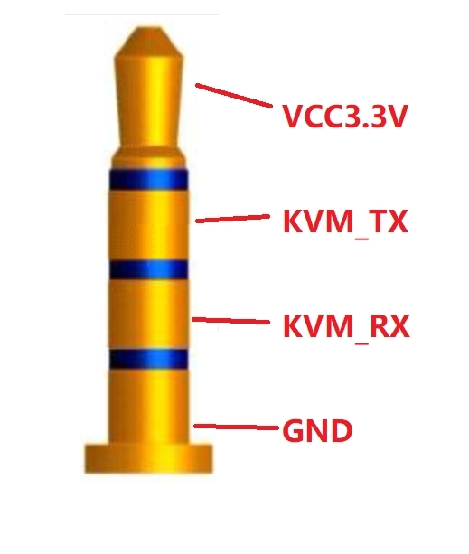

# PiKVM HKS401 Control

Reverse-engineered UART control and PiKVM integration for the **TESmart
HKS401-M24** 4-port KVM.

> **Status:** Experimental. Findings here are from direct testing of an
> HKS401-M24 running `HKS401-M24-SOFMUS2_V_V111-APP` (build May 19,
> 2025). Other firmware/models may differ.

## Overview

This project lets PiKVM control and monitor a TESmart HKS401-M24 through
its 3.3 V TTL UART interface. A dedicated daemon, `hks401d`, is the sole
owner of the UART. PiKVM and command-line clients communicate with that
daemon over a Unix socket.

Current functionality includes:

-   Select PC1-PC4.
-   Detect physical HKS401 input changes.
-   Bidirectionally synchronize HKS401 selection with PiKVM.
-   Query and decode most useful KVM state.
-   Change buzzer, lighting, KM mode, Ethernet, mouse, fan,
    audio-follow and audio selection settings.
-   Start/stop the **real** Auto Scan function.
-   Query actual Auto Scan runtime state.
-   Enable/disable Auto Detect (`0x0F/0x8F`).

## Hardware and TRRS cable

Tested with a Raspberry Pi 4 running PiKVM and a TESmart HKS401-M24.

### A 4-conductor TRRS plug is required

A normal 3-conductor TRS plug is **not sufficient**. The HKS401 UART
jack carries four conductors:

| TRRS contact | Function | STM32F030C8T6 |
| --- | --- | --- |
| Tip | +3.3 V | NC |
| Ring 1 | HKS401 TX | Pin 30 — PA9 / USART1_TX |
| Ring 2 | HKS401 RX | Pin 31 — PA10 / USART1_RX |
| Sleeve | GND | GND(jack's leg to GND |

The two ring positions should be verified on the individual unit before
wiring. On the tested HKS401, UART traces to the STM32F030C8T6:

-   Pin 30 - PA9 = USART1_TX
-   Pin 31 - PA10 = USART1_RX

An earlier TRS plug grounded the second ring/HKS401 RX and prevented
proper bidirectional communication. Moving to TRRS solved the problem.

### Raspberry Pi wiring

| Raspberry Pi | HKS401 |
| --- | --- |
| Physical pin 6 — GND | GND / Sleeve |
| Physical pin 8 — GPIO14/TXD0 | HKS401 RX |
| Physical pin 10 — GPIO15/RXD0 | HKS401 TX |
| No connection | HKS401 +3.3 V / Tip |

**Leave the HKS401 +3.3 V Tip disconnected.** Only TX, RX and common
ground are required.

The interface is **3.3 V TTL, not RS-232**. Do not use a traditional
±RS-232 interface.

## UART configuration

Working Pi serial device:

``` text
/dev/ttyAMA0
```

Pi configuration:

``` text
enable_uart=1
dtoverlay=disable-bt
```

Confirmed serial settings:

``` text
9600 baud, 8 data bits, no parity, 1 stop bit
```

or **9600 8N1**.

TESmart support suggested 38400 during troubleshooting, but 38400 did
not work on the tested unit. 9600 works.

A persistent permission rule can be used:

``` text
KERNEL=="ttyAMA0", GROUP="uucp", MODE="0660"
```

The relevant PiKVM/daemon user should have access through `uucp`.

## UART framing and checksum

Observed commands use:

``` text
AA BB <command> <command-specific data> <checksum>
```

The checksum is the low byte of the additive sum of every preceding
byte.

Example:

``` text
AA BB 03 00 02 6A
```

because:

``` text
AA + BB + 03 + 00 + 02 = 0x16A
checksum = 0x6A
```

Some documentation/early analysis suggested a generic payload-length
field. Current `0x0E` experiments show that the command layouts should
instead be treated as command-specific until all fields are understood.

## PC selection

| Function | Frame |
| --- | --- |
| PC1 | `AA BB 03 00 00 68` |
| PC2 | `AA BB 03 00 01 69` |
| PC3 | `AA BB 03 00 02 6A` |
| PC4 | `AA BB 03 00 03 6B` |
| Next PC | `AA BB 03 FF 00 67` |

## Queries implemented

| State | Query |
| --- | --- |
| PC/monitor topology | `AA BB 81 00 00 E6` |
| Keyboard/mouse focus | `AA BB 82 00 FF E6` |
| Monitor/PC correspondence | `AA BB 83 00 FF E7` |
| Buzzer | `AA BB 84 00 FF E8` |
| Lighting | `AA BB 85 00 FF E9` |
| KM mode (USB keyboard/mouse) | `AA BB 88 00 FF EC` |
| Ethernet/network | `AA BB 89 00 FF ED` |
| Mouse | `AA BB 8A 00 FF EE` |
| Fan | `AA BB 8B 00 FF EF` |
| Audio Follow | `AA BB 8C 00 FF F0` |
| Audio selection | `AA BB 8D 00 FF F1` |
| **Actual Auto Scan runtime** | `AA BB 8E 00 FF F2` |
| Auto Detect | `AA BB 8F 00 FF F3` |

`0x86` and `0x87` did not respond on the tested HKS401-M24. `0x07/0x87`
appears associated with a Mixed Mode feature not supported/implemented
on this unit.

`0x06` (not in TESmart's command sheet) has no observable effect: no
beep, no reply, no unsolicited frames, no change to any queried setting,
and no change to Auto Scan dwell. Tested with data
`00 FF`, `00 00`, `00 01`, `00 03`, `00 05`, `00 0C`, `01 00`, `03 00`,
`FF 00`.

## Decoded query state

### `0x81` topology

Observed response contains `41`, decoded as four PCs and one monitor:

``` json
"ports": {"pcs": 4, "monitors": 1, "raw": "41"}
```

### `0x82` keyboard/mouse focus

``` text
00 = PC1
01 = PC2
02 = PC3
03 = PC4
```

### `0x83` monitor/PC correspondence

``` text
01 00 = Monitor 1 -> PC1
01 01 = Monitor 1 -> PC2
01 02 = Monitor 1 -> PC3
01 03 = Monitor 1 -> PC4
```

The first byte is the 1-based monitor number; the second is the
zero-based PC index.

### Other decoded queries

``` text
0x84 buzzer:
  00 off
  01 on
  (TESmart lists 02 medium / 03 high; this model ignores them and
  keeps reporting 01.)

0x85 lighting:
  04 00 off
  04 01 indicator
  04 02 marquee
  04 03 breathing

0x88 KM mode (USB keyboard/mouse):
  00 passthrough  (KVM beeps once)
  01 compatible   (KVM beeps twice)

0x89 Ethernet:
  first byte = four-PC enable mask
  0F all enabled
  0E PC1 disabled
  0D PC2 disabled
  0B PC3 disabled
  07 PC4 disabled
  second byte = focus PC, 00..03

0x8A mouse wheel switching:
  00 off
  01 on

0x8B fan:
  04 00 off
  04 01 auto
  04 02 low
  04 03 high

0x8C Audio Follow:
  00 off
  01 on

0x8D audio:
  00 PC1
  01 PC2
  02 PC3
  03 PC4
```

With Audio Follow enabled, explicit audio selection is
overridden/follows PC selection.

## Set commands implemented

### Buzzer --- `0x04`

``` text
AA BB 04 00 00 69  # off
AA BB 04 00 01 6A  # on
```

### Lighting --- `0x05`

``` text
AA BB 05 02 00 6C  # off
AA BB 05 02 01 6D  # indicator
AA BB 05 02 02 6E  # marquee
AA BB 05 02 03 6F  # breathing
```

### KM mode --- `0x08`

``` text
AA BB 08 00 00 6D  # passthrough
AA BB 08 00 01 6E  # compatible
```

### Ethernet/network --- `0x09`

``` text
AA BB 09 00 0F 7D  # all on
AA BB 09 00 0E 7C  # PC1 off
AA BB 09 00 0D 7B  # PC2 off
AA BB 09 00 0B 79  # PC3 off
AA BB 09 00 07 75  # PC4 off
```

### Mouse --- `0x0A`

``` text
AA BB 0A 00 00 6F  # off
AA BB 0A 00 01 70  # on
```

### Fan --- `0x0B`

``` text
AA BB 0B 00 00 70  # off
AA BB 0B 00 01 71  # auto
AA BB 0B 00 02 72  # low
AA BB 0B 00 03 73  # high
```

### Audio Follow --- `0x0C`

``` text
AA BB 0C 00 00 71  # off
AA BB 0C 00 01 72  # on
```

### Audio selection --- `0x0D`

``` text
AA BB 0D 00 00 72  # PC1
AA BB 0D 00 01 73  # PC2
AA BB 0D 00 02 74  # PC3
AA BB 0D 00 03 75  # PC4
AA BB 0D FF 00 71  # next
```

## Auto Scan reverse engineering

One of the main findings of this project is that the actual HKS401 Auto
Scan runtime control is **`0x0E/0x8E`**, not `0x0F/0x8F`.

### Confirmed actual Auto Scan query

``` text
AA BB 8E 00 FF F2
```

Responses:

``` text
AA BB 8E 01 00 F4  # stopped
AA BB 8E 01 01 F5  # running
```

This was tested against the physical Auto Scan function.

### Confirmed Auto Scan start/stop

``` text
AA BB 0E 00 01 74  # starts Auto Scan
AA BB 0E 00 00 73  # stops Auto Scan
```

The daemon exposes these as:

``` text
set autoscan on
set autoscan off
query autoscan
```

### Scan interval --- not settable via `0x0E`

The physical keyboard supports:

``` text
Right-Ctrl, Right-Ctrl, Space  # start Auto Scan
Right-Ctrl, Right-Ctrl, +      # increase scan period
Right-Ctrl, Right-Ctrl, -      # decrease scan period
Esc                            # stop Auto Scan
```

The default documented interval is 5 seconds.

Changing the period with the keyboard visibly changes the dwell time but
produces **no UART traffic**.

Controlled timing tests (dwell measured by polling `0x82` every 100 ms,
three dwells per run) show the `0x0E` data bytes do **not** set the
period:

| Frame | `0x8E` reply | Dwell |
| --- | --- | --- |
| `0E 00 01` | `01` | 10.03-10.07 s |
| `0E 00 02/03/05/0A` | echoes `02/03/05/0a` | 10.05-10.08 s |
| `0E 01/02/05/0A 01` | `01` | 10.05-10.07 s |

-   Second byte: any nonzero value starts Auto Scan and is echoed by
    `0x8E`; it has no timing effect.
-   First byte: ignored.
-   The period is held internally (10 s on the tested unit after
    keyboard adjustment) and is neither set nor reported over UART.
-   Each Right-Ctrl, Right-Ctrl, `-` press shortened the dwell by 1 s
    (10 s -> 8 s after two presses). Replies to every query `0x81`-`0x9F`
    were byte-identical before and after, and `0x86`, `0x87`,
    `0x90`-`0x9F` do not reply, so no known query exposes the period.
-   Only ports with an active source are visited (PC1 <-> PC2 in the
    test).

### `0x0F/0x8F` is Auto Detect

``` text
AA BB 0F 00 01 75  # enable Auto Detect
AA BB 0F 00 00 74  # disable Auto Detect
AA BB 8F 00 FF F3  # query
AA BB 8F 01 00 F5  # reply: off
AA BB 8F 01 01 F6  # reply: on
```

With Auto Detect on, a newly connected source is detected and the
buzzer sounds; with it off, connections are ignored. It does not start
or stop Auto Scan.

Measured query round trip (write start to full reply) is ~17 ms:
~6.3 ms per 6-byte frame on the wire plus ~4 ms KVM processing. No
replies were dropped in testing, including queries sent immediately
after a set or back-to-back. The daemon still retries readbacks (first
after 20 ms, then every 100 ms, up to 3 attempts) in case a frame is
lost. A sniffer sees nothing if `hks401d` is running, because the
daemon consumes the reply.

The daemon calls this:

``` text
auto_detect
```

## Unsolicited state frames

Physical PC selection generates unsolicited state:

``` text
AA BB 83 02 01 00 EB  # Monitor 1 -> PC1
AA BB 82 01 00 E8     # focus PC1

AA BB 83 02 01 03 EE  # Monitor 1 -> PC4
AA BB 82 01 03 EB     # focus PC4
```

This lets PiKVM follow a physical HKS401 selection.

### Auto Scan transitions are silent

Starting Auto Scan from the keyboard produces an initial `0x83`/`0x82`
snapshot. Automatic PC-to-PC transitions then produce **no UART
frames**. `Esc` produces another ordinary snapshot.

Explicit `0x82` and `0x83` queries during Auto Scan correctly return the
current PC, and `0x8E` correctly reports whether scanning is active.

The planned daemon strategy is therefore to poll `0x82/0x83` at a modest
rate **only while Auto Scan is active**, rather than continuously
polling the entire KVM.

The daemon must not depend on the nominal five-second scan interval
because a keyboard user can change it locally without producing UART
traffic.

## Auto Detect is separate from Auto Scan

The HKS401 `M`/Auto Detect feature behaves separately:

-   Pressing `M` itself produces no UART frame.
-   With Auto Detect disabled, tested HDMI connect/disconnect events
    produced no UART state.
-   With Auto Detect enabled, qualifying connection events produced
    ordinary `0x83`/`0x82` state.
-   `0x8E` remains `00` when Auto Detect is enabled but Auto Scan is
    stopped.

Thus `0x8E` specifically tracks Auto Scan runtime, not Auto Detect.

## Ethernet jack

The HKS401-M24 LAN jack is not a management endpoint on the tested
hardware. Direct testing showed DHCP/IPv6 traffic from downstream PCs
passing through it, consistent with an internal Ethernet switch/uplink.

No HKS401 management endpoint was found there. TESmart support also
indicated no planned firmware update to add endpoint management.

UART is therefore the management/control path used by this project.

## `hks401d` daemon

The daemon is deliberately the **sole normal owner** of `/dev/ttyAMA0`.

This matters: during reverse engineering, having multiple processes read
the UART caused lost responses and misleading retry behavior.

Architecture:

``` text
HKS401 UART
     |
     v
+-----------+
| hks401d   |  sole UART owner
+-----+-----+
      |
      | Unix socket
      v
/run/hks401d.sock
      |
      +----------> hks401 CLI
      |
      +----------> PiKVM UGPIO plugin
```

Runtime state:

``` text
/run/hks401d-state.json
```

The daemon starts before `kvmd`.

Example daemon operations:

``` text
select 1
select 2
select 3
select 4

query focus
query correspondence
query autoscan

state

set autoscan on
set autoscan off
```

Example decoded state:

``` json
{
  "active_pc": 1,
  "focus_pc": 1,
  "monitor_pc": 1,
  "monitor": 1,
  "ports": {
    "pcs": 4,
    "monitors": 1,
    "raw": "41"
  },
  "buzzer": "on",
  "lighting": "breathing",
  "km_mode": "compatible",
  "network_mask": "0x0f",
  "network_ports": {
    "pc1": true,
    "pc2": true,
    "pc3": true,
    "pc4": true
  },
  "network_focus_pc": 1,
  "mouse": "off",
  "fan": "auto",
  "audio_follow": "on",
  "audio_pc": 1,
  "autoscan": "off",
  "auto_detect": "off"
}
```

## PiKVM integration

The custom UGPIO driver is kept at:

``` text
/usr/local/lib/hks401/hks401.py
```

and linked into the PiKVM Python plugin location:

``` text
/usr/lib/python3.14/site-packages/kvmd/plugins/ugpio/hks401.py
```

The plugin:

-   Talks to `hks401d`, never directly to UART.
-   Polls daemon state.
-   Exposes named UGPIO pins:

| Pins | Type | Daemon command |
| --- | --- | --- |
| `pc1`-`pc4` | choice | `select N` |
| `km_passthrough`, `km_compatible` | choice | `set km_mode MODE` |
| `lighting_off/indicator/marquee/breathing` | choice | `set lighting MODE` |
| `fan_off/auto/low/high` | choice | `set fan MODE` |
| `audio_pc1`-`audio_pc4` | choice | `set audio pcN` |
| `autoscan`, `buzzer`, `mouse` (mouse wheel switching), `audio_follow`, `auto_detect` | on/off | `set NAME on/off` |
| `net_pc1`-`net_pc4` | on/off | `set network_pcN on/off` |
| `pc_next`, `audio_next` | pulse | `select next`, `set audio next` |
| `net_focus_pc1`-`net_focus_pc4` | input | — (0x89 focus PC) |

-   Choice pins act only on the ON transition; turning the active
    choice OFF is ignored.
-   Notifies PiKVM when state changes.

The daemon builds the Ethernet `0x09` frame from the current mask, so
each PC can be toggled independently (`set network_mask 0xNN` sets the
whole mask). Only the all-on and single-PC-off masks have been verified
on hardware.

This provides bidirectional synchronization:

``` text
Physical HKS401 change
        -> UART
        -> hks401d
        -> UGPIO plugin
        -> PiKVM UI
```

and:

``` text
PiKVM UI
        -> UGPIO plugin
        -> hks401d
        -> UART
        -> HKS401
```

### Surviving PiKVM updates

The canonical plugin is kept under `/usr/local` because package files
may be replaced by PiKVM updates.

Helper:

``` text
/usr/local/sbin/install-hks401-kvmd-plugin
```

A `kvmd` systemd drop-in runs:

``` text
ExecStartPre=+/usr/local/sbin/install-hks401-kvmd-plugin
```

to restore the plugin symlink when needed. This recovery mechanism has
been tested by removing the installed link and confirming that it is
recreated.

No PiKVM-owned files are edited:

-   UGPIO config lives in `/etc/kvmd/override.d/hks401.yaml`, not in
    `override.yaml`.
-   UI styling is a marked block in `/etc/kvmd/web.css`, which PiKVM
    serves as `share/css/user.css`. Other user CSS in that file is
    preserved.
-   The only file added inside the KVMD package tree is the plugin
    symlink, which KVMD's plugin loader requires.
-   The helper only writes when something is missing or stale, and
    temporarily remounts the read-only root when it must.

### Deploying from this repo

Edit files in this repo, then deploy:

``` bash
sudo bash /home/pikvm-hks401/deploy.sh
```

## Raw UART testing

Always stop `hks401d` before opening the UART manually:

``` bash
sudo systemctl stop hks401d
```

Passive sniffer:

``` python
import serial
import time

ser = serial.Serial(
    "/dev/ttyAMA0",
    9600,
    bytesize=8,
    parity="N",
    stopbits=1,
    timeout=0.05,
)

start = time.monotonic()

try:
    while True:
        data = ser.read(256)
        if data:
            elapsed = time.monotonic() - start
            print(
                f"+{elapsed:8.3f}s  "
                + " ".join(f"{b:02X}" for b in data),
                flush=True,
            )
finally:
    ser.close()
```

Restart normal operation afterward:

``` bash
sudo systemctl start hks401d
```

Do **not** run a raw UART reader and `hks401d` simultaneously.

## Current status

### Confirmed

-   HKS401-M24 UART operates at 9600 8N1.
-   Electrical interface is 3.3 V TTL.
-   Four-conductor TRRS is required.
-   Additive low-byte checksum.
-   PC1-PC4 selection.
-   Physical selection produces `0x82/0x83` state.
-   Topology and monitor/PC correspondence decoded.
-   Most useful documented settings have working queries/setters.
-   Real Auto Scan starts/stops through `0x0E`.
-   Real Auto Scan runtime is reported by `0x8E`.
-   Automatic scan transitions are UART-silent.
-   Keyboard scan-period changes are UART-silent.
-   `0x0F/0x8F` is Auto Detect, independent of actual Auto Scan.
-   LAN jack is an internal network switch/uplink, not the HKS401
    management interface.
-   PiKVM PC-selection integration works bidirectionally.

### Still being investigated

-   Whether any undocumented command sets or reports the scan period
    (`0x0E` data bytes and `0x06` do not).
-   `0x07/0x87`/Mixed Mode behavior on other models.
-   Conditional `0x82/0x83` polling during Auto Scan.
-   Additional PiKVM UI controls and status indicators.

## Disclaimer

This is an independent reverse-engineering project and is not affiliated
with or endorsed by TESmart or PiKVM. Commands are based on observed
behavior of the tested HKS401-M24 and may differ on other firmware or
hardware revisions.
